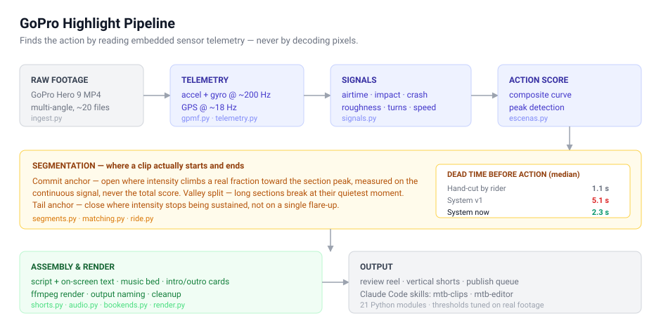

# POV Automation

Turns 20 raw GoPro files into a publishable edit without watching the footage.

A telemetry-driven video pipeline: it finds the action by reading the sensor data
embedded inside the MP4, not by analyzing pixels.



*(Detailed Spanish documentation: [README.es.md](README.es.md))*

---

## The idea

A GoPro Hero 9 records more than video. Embedded in the MP4 is a GPMF telemetry
stream — accelerometer and gyroscope at ~200 Hz, GPS at ~18 Hz. That stream says
exactly where the action was, and it can be parsed in seconds without decoding a
single frame.

| What you see on video | What the sensor measures |
|---|---|
| Jump or drop | accelerometer falls toward 0 g — you are airborne |
| Landing or hit | 3–8 g acceleration spike |
| Crash | hard impact, then velocity goes to zero |
| Fast section | GPS speed, plus the camera's wind gauge |
| Rock garden, roots | high-frequency accelerometer variance |
| Turns, whips | gyroscope energy |

These are combined into a continuous action score, peaks are detected, and
segments are cut with context before and after each moment.

## The hard part: where a clip should start

A clip should not open where the score crosses a threshold. Continuous signals
ramp up gradually, so the crossing happens seconds before anything is visible.

Measured against hand-cut clips on a real ride:

| | median dead time before action | worst case |
|---|---|---|
| Hand-cut by the rider | 1.1 s | 6.3 s |
| System, first version | 5.1 s | 15.3 s |
| **System, current** | **2.3 s** | **7.3 s** |

Three fixes got it there:

1. **Commit anchor.** The clip opens where intensity climbs a real fraction of the
   distance between threshold and section peak, measured on the *continuous*
   signal — never on the total score. Using the total score made it worse in the
   opposite direction: an 8 g impact bonus inflates the peak so much that the
   genuine ramp falls below the cut, turning a clip that opened 6.4 s early into
   one that opened 5.1 s *late*.
2. **Cut at the valley.** A section longer than the max is split at its quietest
   moment, not at a fixed interval. Fixed steps had sliced a 43 s section in half,
   producing two clips whose action started at 14 s and 15 s.
3. **Tail anchor.** The mirror of the commit anchor, with one asymmetry: the head
   only needs to touch the level once, but the tail must *sustain* it. A
   half-second flare-up while the ride winds down was stretching clips by six
   seconds.

That asymmetry is the kind of thing you only find by measuring output against a
human baseline instead of trusting the first implementation that runs.

## Pipeline

```
ingest.py      Discover and group raw camera files
gpmf.py        Parse embedded GoPro telemetry from the MP4 container
telemetry.py   Normalize accelerometer / gyro / GPS streams
signals.py     Derive per-instant signals (airtime, impact, roughness, turns)
escenas.py     Composite action score, peak detection
segments.py    Segment boundaries — commit anchor, valley split, tail anchor
matching.py    Match segments across multiple camera angles
ride.py        Ride-level orchestration
shorts.py      Vertical short-form assembly
shorts_guion.py / shorts_textos.py   Script and on-screen text generation
audio.py       Audio handling and music bed
bookends.py    Intro / outro cards
render.py      ffmpeg render pipeline
naming.py      Output naming conventions
cleanup.py     Intermediate file cleanup
config.py      Defaults, overridden by config.toml
cli.py         Command-line entry point
```

21 modules. Thresholds in `config.toml` are tuned against real footage, and the
comments record *why* — for example, the airtime minimum went from 0.22 s to
0.35 s because 0.22 s fired twice on flat gravel, where rolling over a hump
unloads the bike for a quarter second without leaving the ground.

## Agent integration

Two custom Claude Code skills ship with the project:

- `mtb-clips` — review and triage detected segments
- `mtb-editor` — assemble and script short-form edits

## Stack

Python, ffmpeg, GPMF telemetry parsing, TOML configuration,
Claude Code skills.
